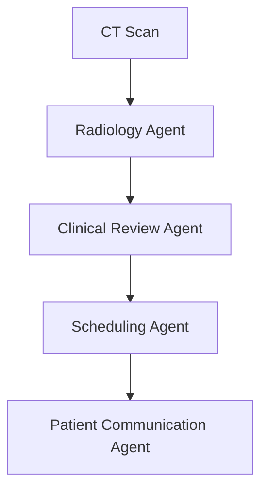
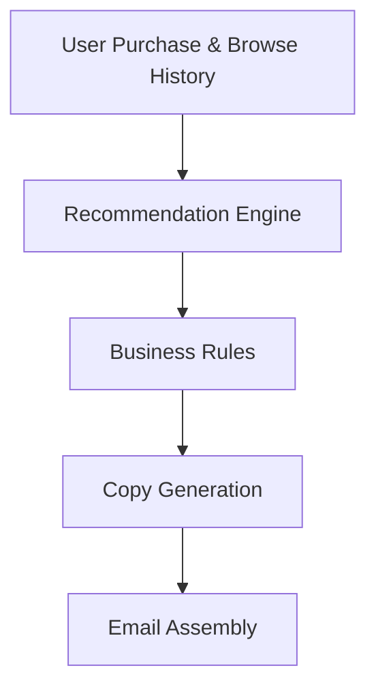
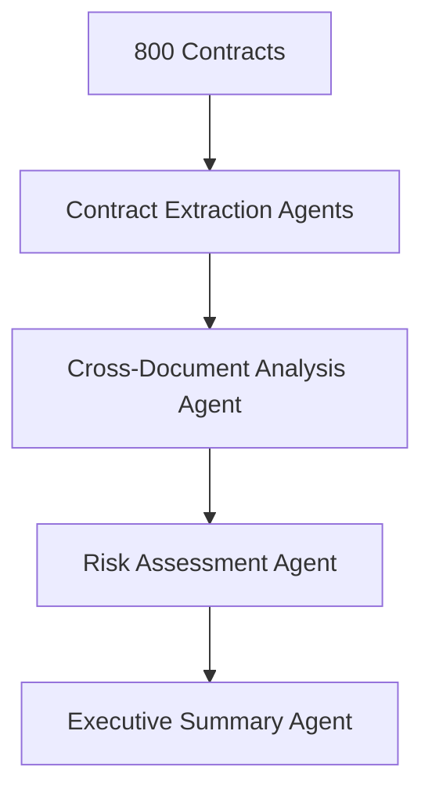
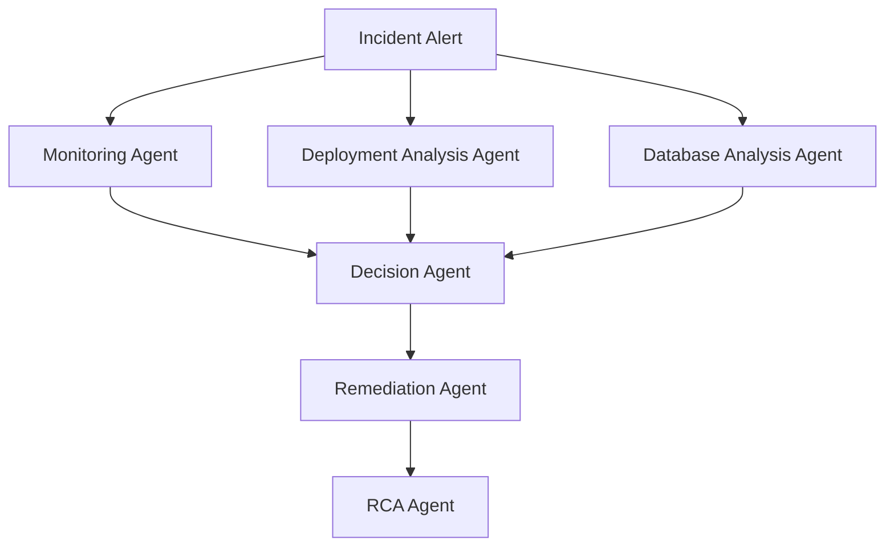

# Automated Radiology Report + Care Pathway

## Agent : Multi-Agent 

## Justification: 
The scenario describes multiple distinct stages, each requiring a different specialization. 
Scenerio itself highlights 4 distinct domains, Sequential with gates and Different tool access.

## Block Diagram :

# Personalized Product Recommendation Email

## Agent : Single Agent 

## Justification:
Same user context is used throughout. Although there are multiple steps, they are all part of one business goal: 
Generate a recommendation email for a user.
The same user data flows through every step, and there are no independent domains making separate decisions.

## Block Diagram 

A single orchestrating agent can invoke all these tools sequentially.

# M&A Due Diligence of 800 Contracts 

## Agent : Multi-Agent

## Justification: 
The scenerio highlights: 800 docs, parallel, Cross-doc synthesis, 4-hour SLA. Consdering the mentioned highlights we can use multi-agent. 
Single agent is not preffered because, a single agent would: 
Process hundreds of documents sequentially or with limited orchestration.
Struggle to efficiently coordinate extraction, comparison, and synthesis.
Become a bottleneck when scaling to hundreds of contracts.

## Block Diagram :

						 
# Indicate Triage and Auto-Remediation

## Agent : Multi-Agent

## Justification :
This CloudOps incident-response scenario contains multiple independent investigations running in parallel, each requiring different tools and expertise.
The scenerio highlights:
Concurrent sub-investigations.
Human-in-the-loop gate.
Different tool surfaces.

## Block Diagram :

		
		
# Summary 
## Choose Multi-Agent when you see:

✅ Parallel investigations
✅ Multiple systems/tools 
✅ Independent specialist tasks
✅ Human approval checkpoints
✅ Orchestration and coordination

## Choose Single Agent when:

✅ One context
✅ One decision-maker
✅ Sequential tool calls
✅ No specialist roles
