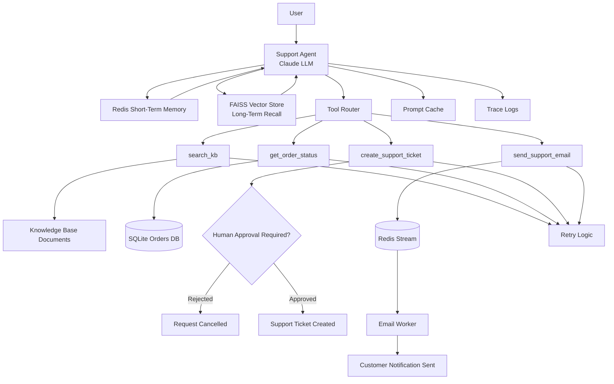

# Customer Support Agent Architecture

```mermaid
flowchart TD

    U[User] --> A[Support Agent<br/>Claude LLM]

    A --> M[Redis Short-Term Memory]
    A --> V[FAISS Vector Store<br/>Long-Term Recall]

    M --> A
    V --> A

    A --> R[Tool Router]

    R --> T1[search_kb]
    R --> T2[get_order_status]
    R --> T3[create_support_ticket]
    R --> T4[send_support_email]

    T1 --> KB[Knowledge Base Documents]

    T2 --> DB[(SQLite Orders DB)]

    T3 --> H{Human Approval Required?}

    H -->|Rejected| X[Request Cancelled]
    H -->|Approved| TK[Support Ticket Created]

    T4 --> Q[(Redis Stream)]

    Q --> W[Email Worker]

    W --> E[Customer Notification Sent]

    A --> C[Prompt Cache]

    A --> TR[Trace Logs]

    T1 --> RET[Retry Logic]
    T2 --> RET
    T3 --> RET
    T4 --> RET
```