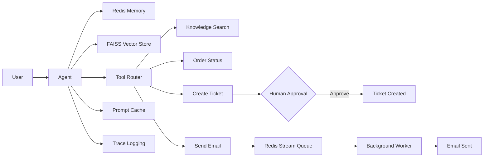

# Customer Support Agent with Redis Memory & Event-Driven Processing

## Overview

This project extends a tool-chaining and Redis Event Queue workflow into an intelligent Customer Support Agent. The solution demonstrates how Large Language Models (LLMs) can orchestrate multiple tools, maintain conversational memory, retrieve knowledge from a vector database, route tasks asynchronously, and incorporate human approval for sensitive actions.

The system combines Redis, SQLite, FAISS, Sentence Transformers, and Claude-based tool orchestration to create a production-inspired support automation workflow.

---

## Features

### Short-Term Memory

* Redis-based conversation memory
* Stores recent interactions
* Maintains context across multiple user requests

### Long-Term Recall

* FAISS vector database
* Semantic search over support knowledge articles
* Retrieves relevant information using embeddings

### Tool Chaining

The agent dynamically selects and executes tools based on user intent.

Available tools:

1. `search_kb`

   * Searches support knowledge articles
   * Uses vector similarity search

2. `get_order_status`

   * Retrieves order information from SQLite

3. `create_support_ticket`

   * Creates customer support tickets
   * Requires human approval

4. `send_support_email`

   * Publishes email events to Redis Streams
   * Processed asynchronously by background workers

### Human-in-the-Loop Approval

Sensitive actions require explicit approval before execution.

Examples:

* Ticket creation
* Escalation workflows

### Event-Driven Processing

Redis Streams enable asynchronous processing.

Benefits:

* Improved responsiveness
* Decoupled architecture
* Scalable event handling

### Reliability Features

#### Retry Logic

* Automatic retries for transient failures
* Improves workflow robustness

#### Prompt Caching

* Avoids repeated LLM calls
* Reduces latency and token consumption

#### Trace Logging

* Records tool execution flow
* Simplifies debugging and observability

---

## Architecture



---

## Technology Stack

| Component            | Technology            |
| -------------------- | --------------------- |
| LLM                  | Claude                |
| Memory               | Redis                 |
| Async Queue          | Redis Streams         |
| Database             | SQLite                |
| Vector Store         | FAISS                 |
| Embeddings           | Sentence Transformers |
| Language             | Python                |
| Notebook Environment | Google Colab          |

---

## Project Workflow

### Knowledge Retrieval Flow

```text
User Query
    ↓
Support Agent
    ↓
Vector Search
    ↓
Relevant Knowledge Retrieved
    ↓
Response Generated
```

### Ticket Escalation Flow

```text
User Issue
    ↓
Support Agent
    ↓
Ticket Tool
    ↓
Human Approval
    ↓
Ticket Created
```

### Email Notification Flow

```text
Support Agent
    ↓
Redis Stream
    ↓
Background Worker
    ↓
Email Sent
```

---

## Example Queries

### Refund Policy

```text
User:
What is your refund policy?

Agent:
Refunds take 5–7 business days.
```

### Order Status

```text
User:
Check order status for Order 101

Agent:
Order 101 is currently being processed.
```

### Ticket Creation

```text
User:
Create a support ticket for my issue.

Agent:
Approval required.

Type YES to continue.
```

---

## Repository Structure

```text
Customer-Support-Agent/
│
├── Chaining_Redis_Event_Queue.ipynb
├── README.md
├── requirements.txt
└── assets/
```

---

## Learning Objectives

This project demonstrates:

* Tool Calling
* Tool Chaining
* Redis Memory
* Vector Search
* Retrieval-Augmented Generation (RAG)
* Human Approval Workflows
* Event-Driven Architectures
* Async Processing
* Prompt Caching
* Observability & Tracing

---

## Capstone Requirements Coverage

| Requirement                   | Status |
| ----------------------------- | ------ |
| Redis Short-Term Memory       | ✅      |
| Vector Store Long-Term Recall | ✅      |
| Three or More Tools           | ✅      |
| Async Queue-Backed Tool       | ✅      |
| Tool Routing                  | ✅      |
| Tool Chaining                 | ✅      |
| Human Approval Gate           | ✅      |
| Trace Logging                 | ✅      |
| Retry Logic                   | ✅      |
| Prompt Caching                | ✅      |

---

## Future Enhancements

* Multi-agent orchestration
* Sentiment analysis
* Ticket prioritization
* Dashboard for trace monitoring
* LangGraph integration
* MCP-based tool architecture
* Cloud-hosted vector database
* Real email service integration

---

## Conclusion

This project demonstrates a production-style AI Customer Support Agent capable of combining memory, retrieval, tool orchestration, human oversight, and asynchronous event processing. It showcases key patterns used in modern enterprise AI systems while remaining lightweight enough to run entirely within Google Colab.
