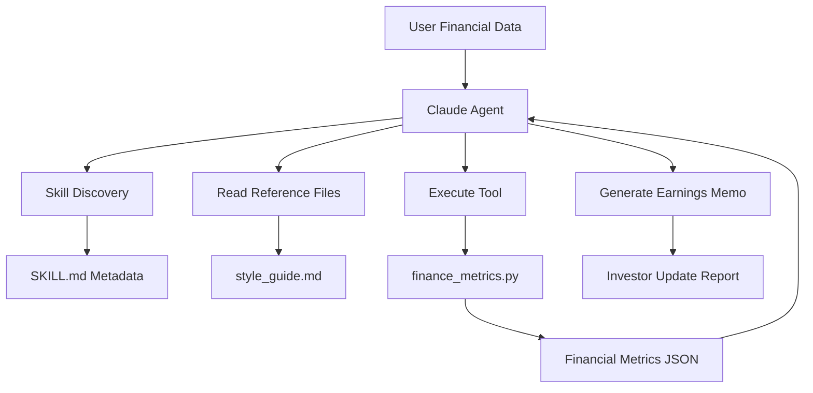

# Claude SKILL.md Demo – Financial Services

A hands-on demonstration of Anthropic's Skills framework using a Financial Services use case. This notebook builds and executes a custom skill called **earnings-summary**, which converts raw quarterly financial data into a standardized investor update memo.

## Overview

This project demonstrates how Claude Skills work by:

- Creating a custom skill structure on disk
- Defining skill metadata and instructions
- Executing deterministic Python code through skill scripts
- Loading reference documents on demand
- Discovering skills through metadata
- Running a tool-calling agent loop
- Generating professional earnings summary reports

The example follows a Financial Services workflow where raw quarterly earnings figures are transformed into a structured investor-facing memo.

---

## Project Structure

```text
skills/
└── earnings-summary/
    ├── SKILL.md
    ├── scripts/
    │   └── finance_metrics.py
    └── references/
        └── style_guide.md
```

### Components

| Component | Purpose |
|------------|-----------|
| SKILL.md | Skill metadata, instructions, and activation criteria |
| finance_metrics.py | Deterministic financial metric calculator |
| style_guide.md | Memo formatting and writing standards |
| Agent Runtime | Discovers skills and executes tools |
| Claude API | Generates final investor summary |

---

## Features

### Skill Discovery
- Parses skill metadata
- Builds metadata-only system prompt
- Determines when a skill should be activated

### Financial Calculations
Automatically computes:

- Revenue Growth %
- Net Margin %
- Earnings Per Share (EPS)
- Financial performance indicators

### Progressive Disclosure
Loads additional context only when required:

- Style guides
- Reference documents
- Supplemental instructions

### Tool Calling Workflow
Supports:

- Reading skill files
- Executing Python scripts
- Returning structured JSON results
- Feeding outputs back to Claude

---

## Architecture



---

## Prerequisites

- Python 3.10+
- Google Colab or Jupyter Notebook
- Anthropic API Key

---

## Installation

Install the Anthropic SDK:

```bash
pip install anthropic
```

Set your API key:

```python
import os

os.environ["ANTHROPIC_API_KEY"] = "your_api_key"
```

---

## Running the Notebook

### 1. Clone Repository

```bash
git clone <repository-url>
cd <repository-name>
```

### 2. Open Notebook

```bash
jupyter notebook Claude_SKILL_md_FinancialServices_Demo.ipynb
```

or upload to Google Colab.

### 3. Execute Cells Sequentially

Run all notebook cells from top to bottom.

The notebook will:

1. Install dependencies
2. Create skill directory structure
3. Generate skill files
4. Discover installed skills
5. Register runtime tools
6. Execute the agent loop
7. Generate a financial summary report

---

## Skill Workflow

### Step 1: Skill Creation

Creates:

```text
earnings-summary/
├── SKILL.md
├── scripts/
│   └── finance_metrics.py
└── references/
    └── style_guide.md
```

### Step 2: Skill Discovery

Claude reads only the metadata section from:

```text
SKILL.md
```

and determines when the skill should be activated.

### Step 3: Tool Execution

When financial data is provided:

```json
{
  "company": "Example Corp",
  "revenue_current": 1200000,
  "revenue_previous": 1000000,
  "net_income": 180000,
  "shares_outstanding": 50000
}
```

the calculator script generates:

```json
{
  "revenue_growth_pct": 20.0,
  "net_margin_pct": 15.0,
  "eps": 3.6
}
```

### Step 4: Memo Generation

Claude combines:

- Financial metrics
- Skill instructions
- Style guide

to create a structured investor update memo.

---

## Example Use Case

### Input

```text
Generate an earnings summary for Q2 results.
Revenue increased from $1M to $1.2M.
Net income was $180K.
Shares outstanding were 50K.
```

### Output

```text
Company Q2 Earnings Summary

Key Highlights
- Revenue grew 20% YoY
- Net Margin reached 15%
- EPS increased to 3.6

Outlook
...
```

---

## Learning Objectives

This notebook demonstrates:

### Level 1
Skill discovery and metadata loading.

### Level 2
On-demand retrieval of skill resources.

### Level 3
Execution of deterministic code outside the model context.

### Level 4
Tool-calling agent workflows integrated with Claude.

---

## Production Considerations

For enterprise deployments:

- Store skills in version control
- Maintain reusable skill libraries
- Separate instructions from code
- Use deterministic scripts for calculations
- Apply least-privilege access controls
- Log tool execution for auditing

---

## Technologies Used

- Python
- Anthropic Claude API
- Tool Calling
- JSON
- Markdown-based Skills
- Jupyter Notebook / Google Colab

---

## Future Enhancements

- Multi-skill orchestration
- Financial statement ingestion
- PDF report generation
- Market sentiment analysis
- Earnings trend visualization
- Portfolio risk assessment

---

## Author

Financial Services Skills Framework Demo built to illustrate Anthropic's custom Skills architecture and tool execution workflow.

---