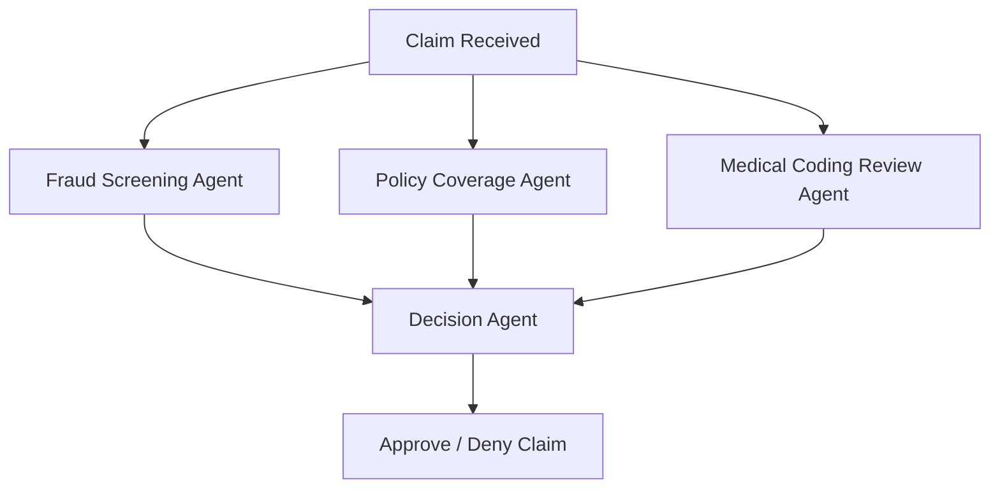
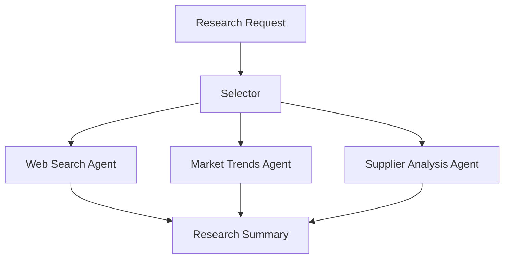
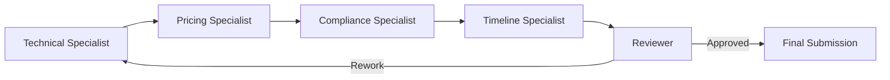

# Scenario 1: Claims Adjudication (Insurance)

## Selected Pattern: GraphFlow

### Justification
- Three independent checks run in parallel:
  - Fraud Screening Agent
  - Policy Coverage Agent
  - Medical Coding Review Agent
- A final Decision Agent waits for all results before approving or denying the claim.
- This is a Directed Acyclic Graph (DAG) workflow with parallel branches and a merge step.

### Block Diagram

---

# Scenario 2: Buyer's Research Assistant (Retail)

## Selected Pattern: Selector

### Justification
- The merchandising team requests information about multiple materials.
- Number and type of research tasks are not known beforehand.
- A Selector dynamically chooses the best research agent/tool for each material.
- Web search and data lookup capabilities may vary per request.

### Block Diagram

---

# Scenario 3: RFP Response Builder (Manufacturing)

## Selected Pattern: Swarm / Handoff

### Justification
- Multiple specialists own different sections:
  - Technical
  - Pricing
  - Compliance
  - Timeline
- Work is passed between specialists.
- Reviewer may send sections back for rework.
- Handoff between agents is the primary interaction pattern.

### Block Diagram

